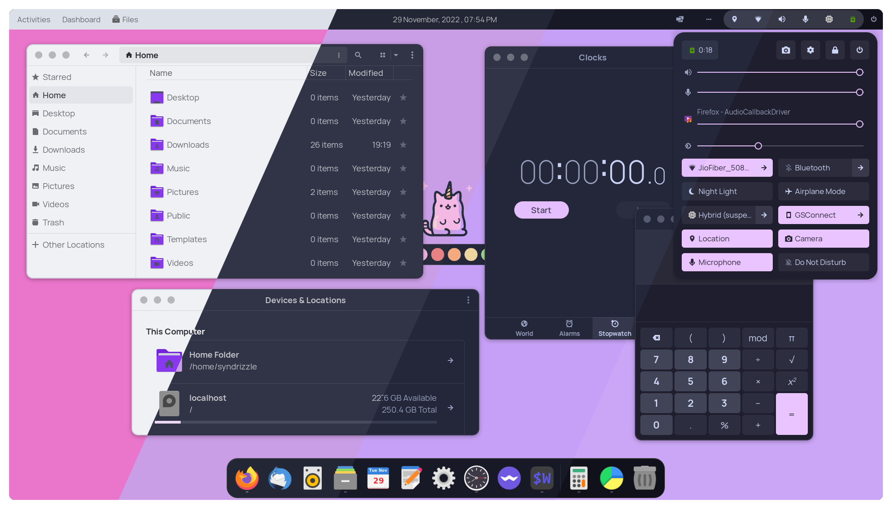

<h3 align="center">
	<br/>
	
	Catppuccin for <a href="https://gtk.org/">GTK</a>
	
</h3>

<p align="center">
    <a href="https://github.com/catppuccin/gtk/stargazers"></a>
    <a href="https://github.com/catppuccin/gtk/issues"></a>
    <a href="https://github.com/catppuccin/gtk/contributors"></a>
</p>

<p align="center">
  
</p>

# About

This GTK theme is based on the [Colloid](https://github.com/vinceliuice/Colloid-gtk-theme) theme made by [Vinceliuice](https://github.com/vinceliuice)

## Usage

### Requirements

-   GTK `>=3.20`
-   `gnome-themes-extra` (or `gnome-themes-standard`)
-   Murrine engine

### Installation

1. Download and extract the theme zip from [releases](https://github.com/catppuccin/gtk/releases/) or you can install the theme from the [AUR](#for-arch-linux-users).
2. Move the theme folder to **".themes"** in your home directory. **(~/.themes)** (Skip this step if you are using the AUR package)
3. Select the downloaded theme via your desktop specific tweaks application (**gnome-tweaks** on Gnome 3+).

### For Arch Linux users

We have 4 AUR packages for all the 4 flavours of the theme:
- [Latte](https://aur.archlinux.org/packages/catppuccin-gtk-theme-latte)
- [Frappe](https://aur.archlinux.org/packages/catppuccin-gtk-theme-frappe)
- [Macchiato](https://aur.archlinux.org/packages/catppuccin-gtk-theme-macchiato)
- [Mocha](https://aur.archlinux.org/packages/catppuccin-gtk-theme-mocha)

With your favourite AUR helper, install them:
  ```bash
  yay -S catppuccin-gtk-theme-mocha catppuccin-gtk-theme-macchiato catppuccin-gtk-theme-frappe catppuccin-gtk-theme-latte
  ```

### For gtk-4.0 users

To theme gtk-4.0 applications you have to manually symlink the `~/.config/gtk-4.0/` to the themes folder. Use the following commands
```
mkdir -p "${HOME}/.config/gtk-4.0"
ln -sf "${THEME_DIR}/gtk-4.0/assets" "${HOME}/.config/gtk-4.0/assets"
ln -sf "${THEME_DIR}/gtk-4.0/gtk.css" "${HOME}/.config/gtk-4.0/gtk.css"
ln -sf "${THEME_DIR}/gtk-4.0/gtk-dark.css" "${HOME}/.config/gtk-4.0/gtk-dark.css"
```

### For Flatpak users

1. To give your Flatpaks access to your themes folder run:
  ```bash
  sudo flatpak override --filesystem=$HOME/.themes
  ```
2. To set the theme for all Flatpaks, replace `##theme##` with the name of the theme you want to use and run this command:
  ```bash
  sudo flatpak override --env=GTK_THEME=##theme##
  ```
3. For a more in depth tutorial see Hamza Algohary's tutorial on [It's Foss](https://itsfoss.com/flatpak-app-apply-theme/)

### Using the script

**Note**: Ensure that you have atleast python version 3.10 installed

Clone the repository using
```bash
git clone --recurse-submodules git@github.com:catppuccin/gtk.git
virtualenv -p python3 venv  # to be created only once and only if you need a virtual env
source venv/bin/activate  
pip install -r requirements.txt
```
To check out the install script, run 
```bash
python install.py --help
```
> Tip: `python install.py --help` allows the following options:

```
Compulsory field        Specify color variant(s) [mocha|frappe|macchiato|latte|all]
-d, --dest DIR          Specify destination directory (Default: ~/.themes)
-n, --name NAME         Specify theme name (Default: Colloid)
-a, --accent VARIANT... Specify theme color variant(s) [rosewater|flamingo|pink|mauve|red|maroon|peach|yellow|green|teal|sky|
                        sapphire|blue|lavender|all] (Default: blue)
-s, --size VARIANT...   Specify size variant [standard|compact] (Default: standard variant)
-l, --libadwaita        Link installed gtk-4.0 theme to config folder for all libadwaita app use this theme
--zip                   Zips up the finally produced themes. 
--tweaks                Specify versions for tweaks [black|rimless|normal]
                        1. black:    Blackness color version
                        2. rimless:  Remove the 1px border about windows and menus
                        3. normal:   Normal windows button style (titlebuttons: max/min/close)
-h, --help              Show help
```
You can install any theme like the following example
```bash
python install.py mocha -a sky --tweaks rimless -d ~/.themes

```
You can build all possible variations of the theme possible using the following command and it will install it to releases folder
```bash
python install.py all -a all
```

## Development

A few important notes to keep in mind

* `recolor.py` handles all changes that needs to be done to colloid to ensure it generated catppuccin colors. If vinceliuice changes anything in his theme in future, that is where you must change
* `var.py` includes all different variables that you can tinker around as per your personal requirements. 
* `create_theme.py` consists of a wrapper that will recolor the colloid theme, install it as per the args provided and rename it accordingly. 
 
## 💝 Thanks to

**Current maintainers**
- [npv12](https://github.com/npv12)
- [ghostx31](https://github.com/ghostx31)
- [Syndrizzle](https://github.com/Syndrizzle)

**Contributions**
- [rubyowo](https://github.com/rubyowo) - for working on the build and CI script

**Previous maintainer(s)**
- [sadrach-cl](https://github.com/sadrach-cl)

&nbsp;

<p align="center"></p>
<p align="center">Copyright &copy; 2021-present <a href="https://github.com/catppuccin" target="_blank">Catppuccin Org</a>
<p align="center"><a href="https://github.com/catppuccin/gtk/blob/main/LICENSE"></a></p>
