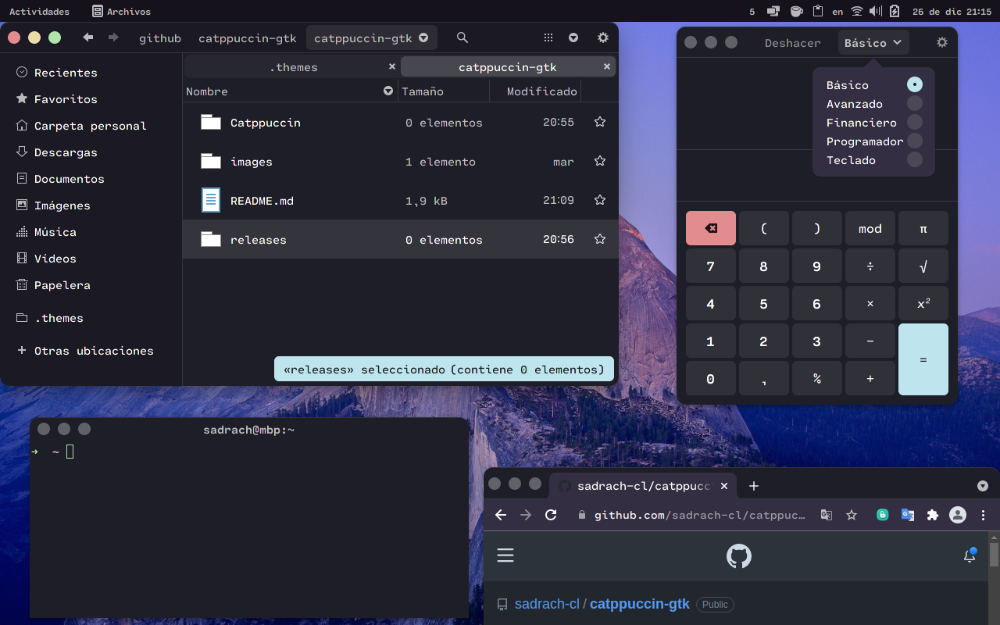

# Catppuccin GTK3+ theme.

Theme inspired by the [Catppuccin project.](https://github.com/catppuccin) 
Based on the [WhiteSur](https://github.com/vinceliuice/WhiteSur-gtk-theme/) theme by [Vinceliuice](https://github.com/vinceliuice).

## Installation

- Download and extract the **Catppuccin.tar.xz** file. or **Catppuccin-light.tar.xz** file.
[From Release](https://github.com/sadrach-cl/catppuccin-gtk/releases/)

- Move the theme folder to **".themes"** in your home directory. **(~/.themes)**
- Select **"Catppuccin** or **Catppuccin-light"** via your desktop specific tweaks application (**gnome-tweaks** on Gnome3+).
  
## About Catppuccin proyect

	Catppuccin is a community-driven pastel theme that aims to be the middle ground between low and high contrast themes. It provides a warm palette with 18 eye-candy colors that are not only perfect for coding under various light conditions, but also for developing graphical user interfaces, making it extensible for numerous use-cases. In addition, this repository tracks the development of the actual color palette, organization-wide assets, resources and code samples for maintainers/developers.

## 🧠 Design Philosophy

-   **Colorful is better than colorless**: the colorfulness of something contributes to the distinction amongst the parts of that _something_, making it marginally easier to understand how things are structured.
-   **There should be balance**: not too dull, not too bright. Suitability under various light conditions is a most.
-   **Harmony is superior to dissonance**: vivacious colors must complement each other.

## 📜 License

Catppuccin is released under the MIT license, which grants the following permissions:

-   Commercial use
-   Distribution
-   Modification
-   Private use

For more convoluted language, see the [LICENSE file](https://github.com/catppuccin/catppuccin/blob/main/LICENSE.md).

